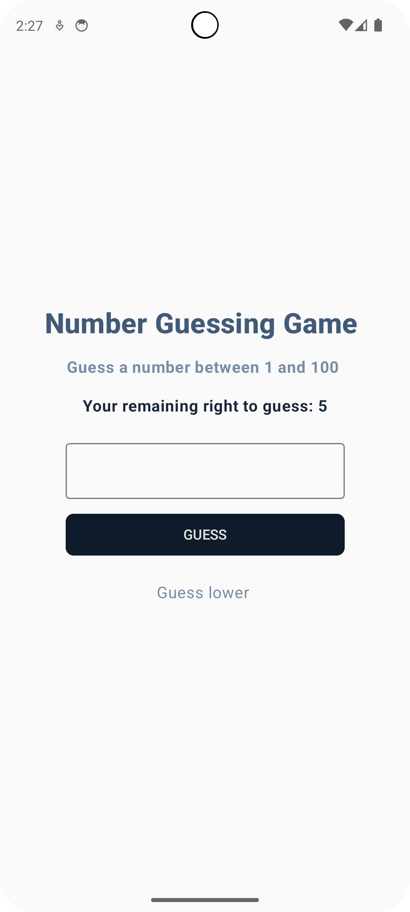
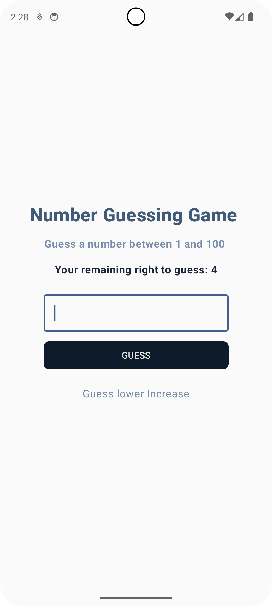
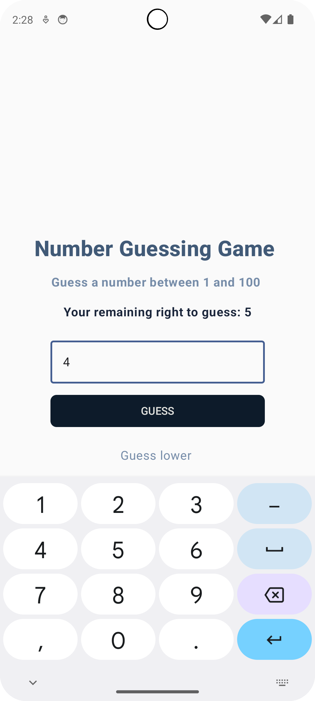

# Jetpack Compose Guess Number UI

This project demonstrates a **Game** and **Guess game** **Result game** screen built using **Jetpack Compose** in Android. It features a clean, modern UI with input fields, password toggles, and navigation transitions.

## ✨ Features

- Guess number
- "Forgot password?" link
- Navigation game,play game,result game

## 📸 Screenshots

|| |||||

## 🛠 Built With

- Kotlin
- Jetpack Compose
- Material Design
- Android Navigation Component
